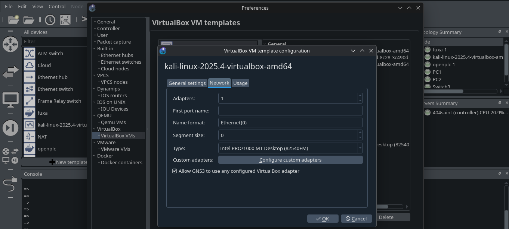
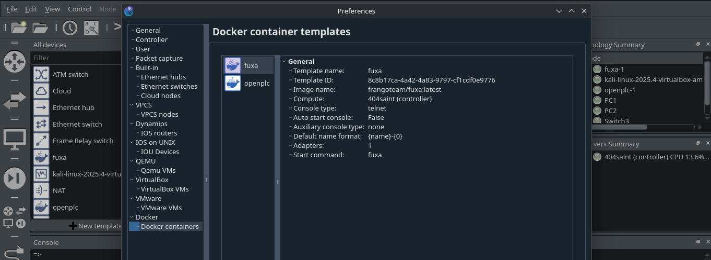
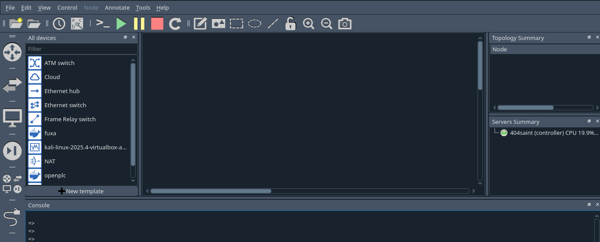
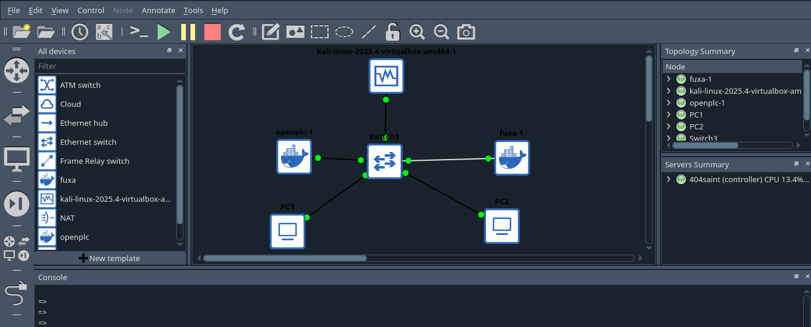
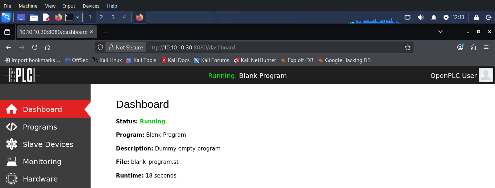
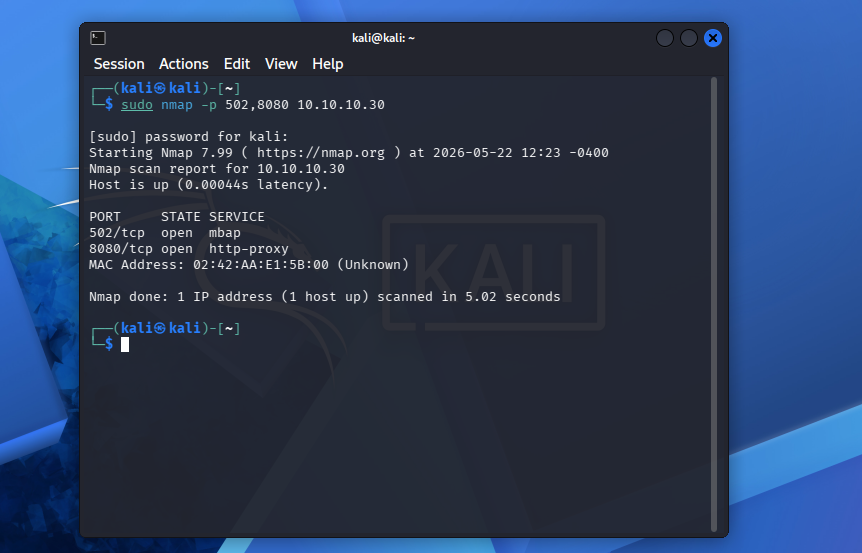

# Comprehensive Lab Deployment & Verification Manual

This guide walks you through building the entire ICS/OT security lab framework inside GNS3 from absolute scratch. No prior advanced familiarity with GNS3 link bridging or containerized appliances is required.

---

## Phase 1: Environment Provisioning (Adding Your Nodes to GNS3)

Before building the topology canvas, you must import and define your virtual hardware nodes within the GNS3 global preferences workspace.

### 1. Importing the Kali Linux Virtual Machine
*Note: Ensure your Kali Linux VM is already configured and functional inside VirtualBox before proceeding.*

1. Launch the **GNS3 GUI application**.
2. Navigate to the top menu menu: **Edit** -> **Preferences**.
3. In the left-hand sidebar menu, locate the **VirtualBox** dropdown category and click on **VirtualBox VMs**.
4. Click the **New** button at the bottom of the configuration window.
5. In the dropdown list, select your target **Kali Linux VM** instance and click **Finish**.
6. Select the newly added Kali VM from the list, click **Edit**, navigate to the **Network** tab, check the box for **"Allow GNS3 to use any configured VirtualBox adapter"**, and click **OK**.



### 2. Pulling the Docker Node Micro-Appliances
GNS3 pulls raw application layers directly from Docker Hub natively. 

1. While still inside the **Preferences** panel, look at the left sidebar dropdown category named **Docker** and click on **Docker containers**.
2. Click the **New** button.
3. In the **Image name** parameter field, type the official public OpenPLC target tag exactly: `wzy318/openplc:latest` and click **Next**.
4. Set the **Adapters** count to `1`, click **Next**, select `telnet` as the console type, and click **Finish**.
5. Click **New** once again to add the Human-Machine Interface appliance.
6. Type the official Fuxa HMI image path: `frangoteam/fuxa:latest`, set adapters to `1`, keep console as `telnet`, and complete the setup wizard.
7. Click **Apply** and then **OK** to close the global preferences workspace.



---

## Phase 2: Canvas Construction & Hardware Wiring

Now, let's pull our structural layout onto the visual grid canvas.





1. Create a brand new project space and name it `ics_baseline_sandbox`.
2. Look at the left-hand vertical toolbar panel. Click on the **Browse Browse Network Devices** icon (the dual-arrow switch graphic) and drag a standard **Ethernet Switch** onto the blank center grid workspace.
3. Click on the **Browse End Devices** icon (the computer monitor graphic) in the toolbar panel:
   * Drag your **Kali Linux VM** node onto the canvas grid.
   * Drag the **wzy318/openplc** Docker node onto the canvas grid.
   * Drag the **frangoteam/fuxa** Docker node onto the canvas grid.
4. To simulate standard field sensor devices or lightweight operator terminals, let's deploy two native Virtual PCs (VPCs):
   * From that same End Devices drawer, drag **two separate instances** of the standard **VPCS** appliance onto the canvas. (They will label automatically as `PC1` and `PC2`).
5. Activate the **Add a Link** wiring tool from the bottom left vertical panel menu (the ethernet cable icon plug graphic).
6. Click on each individual node icon, select its primary network socket adapter card allocation (`eth0` or `Slot 1`), and run the cable drop directly to an available free port line connector slot on the central **Ethernet Switch**.



---

## Phase 3: Explicit Static IP Interface Configuration

Because GNS3 strips away conventional automated host network translation layers to give you raw control over the packet wire, these appliances will not boot with dynamic IP properties. You must explicitly configure their network interface maps.

### 1. Provisioning the OpenPLC and Fuxa Containers

1. Ensure the topology node states are currently powered down (**Red Square / Stop** mode).
2. Right-click the **OpenPLC** node icon on your canvas grid and select **Configure**.
3. In the configuration window properties layout, click the **Network** tab, and then click the **Edit** button.
4. Erase any placeholder comment text strings and paste this precise static configuration allocation map blocks:

```text
auto eth0
iface eth0 inet static
    address 10.10.10.30
    netmask 255.255.255.0

```

5. Click **Save** and then **Apply**.
6. Right-click the **Fuxa** node icon, select **Configure**, head to **Network** -> **Edit**, and paste the configuration block tracking its custom IP:

```text
auto eth0
iface eth0 inet static
    address 10.10.10.40
    netmask 255.255.255.0

```

7. Click **Save** and confirm changes.

### 2. Provisioning the Virtual PCs (VPCS)

Configuring static profiles on the native GNS3 lightweight Virtual PCs is handled quickly directly inside their interactive shell prompts.

1. Click the big green **Play / Start** icon triangle button in the top toolbar menu row to boot your canvas nodes.
2. Double-click on **PC1** to launch its dedicated command line console interface text box.
3. Enter the following network definition command string directly to bind its IP target and hit Enter:
```bash
ip 10.10.10.101 255.255.255.0

```


4. Type `save` and hit Enter to preserve the hardware data across lab reboots.
5. Close the console window box, double-click on **PC2** to open its console interface terminal, and assign its respective address:
```bash
ip 10.10.10.102 255.255.255.0

```


6. Type `save` and confirm.

### 3. Provisioning the Kali Linux VM

1. Click into your running **Kali Linux VM** system environment workspace screen interface.
2. Launch a root terminal emulator window shell, and execute the following commands sequence to completely flush standard volatile DHCP host assignments and declare the static environment boundary address:

```bash
sudo ip addr flush dev eth0
sudo ip addr add 10.10.10.5/24 dev eth0
sudo ip link set eth0 up

```

---

## Phase 4: Runtime Daemon Activation & Laboratory Verification

With the wiring and structural routing pools set up, we must pass manual traffic sweeps to confirm the industrial protocol engines are awake.

1. Inside your **Kali Linux VM**, launch your favorite native web browser application.
2. In the URL address target bar path, navigate directly to the OpenPLC core management panel using plain text HTTP syntax:
```text
http://10.10.10.30:8080

```
3. Authenticate to the system core dashboard portal using the standard initial factory configuration values:
   * **Username:** `openplc`
   * **Password:** `openplc`
4. Review the prominent primary status block banner on the dashboard workspace monitor. If the status state reads **Stopped**, click the **Start PLC** option button located on the left side panel index rows. 
5. *Note:* If the compilation engine hangs or fails to progress out of an initialization state due to double-clicking lag bugs, consult the exact mitigation steps inside the advanced [TROUBLESHOOTING.md](TROUBLESHOOTING.md) ledger.



To confirm that the internal Modbus server engine is officially processing communication down the virtual bus wire, drop out to your Kali terminal workspace and execute a focused network port audit sweep scan:

```bash
sudo nmap -p 502,8080 10.10.10.30

```

### Expected Output Target Blueprint Validation



The moment port `502/tcp` throws a clean **open** status response flag, your virtual lab infrastructure validation is successfully complete. The isolated laboratory environment is fully prepared for custom script interrogation, deep industrial protocol fuzzing, or tracking graphic interface dashboard mappings via Fuxa on `.40`.
