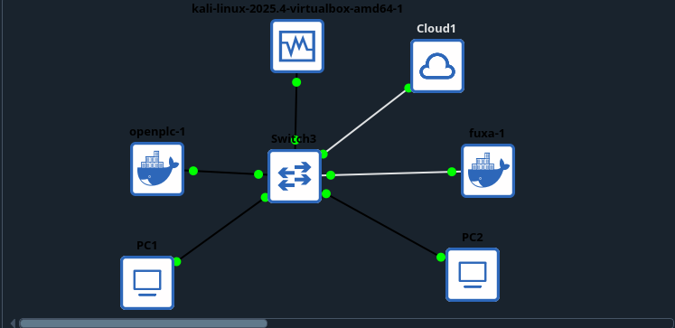

# GNS3 ICS/OT Security Emulation Lab

This repository contains the architecture and configuration blueprints for deploying a fully isolated, production-grade Industrial Control Systems (ICS) and Operational Technology (OT) simulation sandbox. 

Built inside **GNS3** on a Linux host, this lab provides a safe environment for simulating industrial workflows, auditing Modbus TCP traffic, and testing human-machine interface (HMI) integrations without risking interference with live physical infrastructure or local networks.

## Lab Architecture

The environment utilizes a dedicated, non-overlapping host-isolated subnet to eliminate routing conflicts with physical hardware gateways.

* **Attacker/Auditor Node:** Kali Linux VM (VirtualBox/QEMU integration)
* **Programmable Logic Controller (PLC):** OpenPLC Core Container (Modbus TCP on `502/tcp`, Web Dashboard on `8080/tcp`)
* **Human-Machine Interface (HMI):** Fuxa Web Graphics Container (`1881/tcp`)
* **Network Core:** Standard GNS3 Ethernet Switch
* **Host Bridge:** GNS3 Cloud Node (Bridged loopback for local administration)

### Network Topology Diagram

