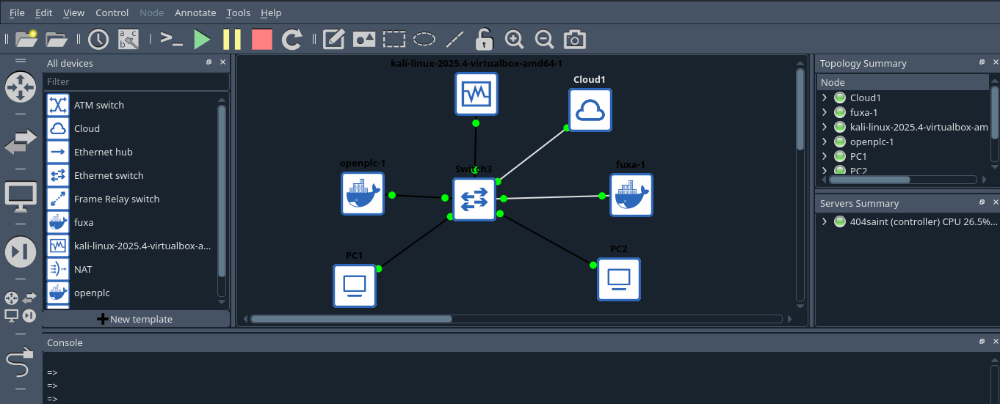

# GNS3 ICS/OT Security Emulation Lab

This repository contains the architecture and configuration blueprints for deploying a fully isolated, production-grade Industrial Control Systems (ICS) and Operational Technology (OT) simulation sandbox. 

Built inside **GNS3** on a Linux host, this lab provides a safe environment for simulating industrial workflows, auditing Modbus TCP traffic, and testing human-machine interface (HMI) integrations without risking interference with live physical infrastructure or local networks.

## 🚀 Getting Started

If you are setting this lab up for the first time or want an explicit, step-by-step UI deployment walkthrough, go straight to the manual:

👉 **[Read the Complete Setup Manual (NOTES.md)](NOTES.md)**

For deep dives into the network anomalies, kernel-level port collisions, and firewall rules encountered during development, check the technical ledger:

👉 **[Read the Troubleshooting Ledger (TROUBLESHOOTING.md)](TROUBLESHOOTING.md)**

---

## Lab Architecture

The environment utilizes a dedicated, non-overlapping host-isolated subnet to eliminate routing conflicts with physical hardware gateways.

* **Attacker/Auditor Node:** Kali Linux VM (VirtualBox/QEMU integration)
* **Programmable Logic Controller (PLC):** OpenPLC Core Container (Modbus TCP on `502/tcp`, Web Dashboard on `8080/tcp`)
* **Human-Machine Interface (HMI):** Fuxa Web Graphics Container (`1881/tcp`)
* **Network Core:** Standard GNS3 Ethernet Switch
* **Field Devices:** Native Lightweight Virtual PCs (VPCS)

### Network Topology Diagram

## Repository Structure

* `README.md`          - Core lab overview and architectural breakdown.
* `NOTES.md`           - Clean, step-by-step installation and verification manual.
* `TROUBLESHOOTING.md` - Technical ledger of network quirks, kernel mapping, and resolution steps.

## Core Network Allocations

* **Subnet Mapping:** `10.10.10.0/24`
* **Kali Linux VM:** `10.10.10.5`
* **OpenPLC Engine:** `10.10.10.30`
* **Fuxa HMI Platform:** `10.10.10.40`
* **Simulated Endpoints (VPCS):** `10.10.10.101` - `10.10.10.102`

---

## 👨‍💻 Author

Developed and maintained by **Rugero Tesla (404saint)**. Feel free to reach out or contribute updates if you run into new quirks!
